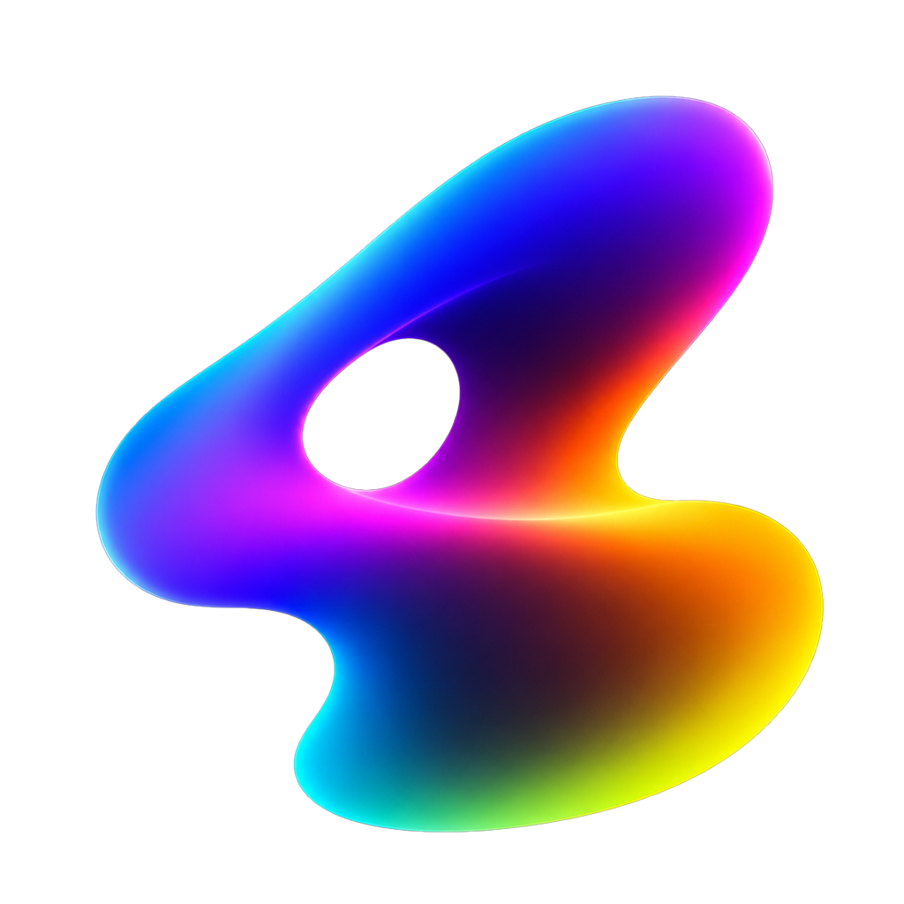

<p align="center">
  
</p>

<h1 align="center">Junkpile</h1>

<p align="center"><strong>Standalone coding examples for creative graphics, live media, and native GPU application development.</strong></p>

Junkpile is a reference library of **78 independently runnable desktop applications** organized into three complete `00–25` tracks:

- **26 Tauri v1 WebView examples**
- **26 Tauri v2 WebView examples**
- **26 native Rust/wgpu examples**

Each example is intentionally isolated. You can install, run, inspect, modify, and package one project without building the entire repository.

## Start here

Read the full developer documentation in [`docs.html`](docs.html). It includes installation, platform prerequisites, architecture, verification, troubleshooting, and the complete example catalog.

To run one example immediately:

```bash
git clone https://github.com/schwwaaa/junkpile.git
cd junkpile

# Choose one project from v1/, v2/, or native-wgpu/.
cd v2/12-tauri-v2-video-texture-player

npm install
npm run dev
```

Build its production application with:

```bash
npm run build
```

Do not run `npm install` or `npm run build` from the repository root unless a future root workspace explicitly supports it. Each example owns its dependencies and build configuration.

## Requirements

All examples require:

- Git
- Node.js with npm
- Rust with Cargo
- the operating-system prerequisites required by Tauri

Check the toolchain before opening an example:

```bash
git --version
node --version
npm --version
rustc --version
cargo --version
```

### macOS

Install the Xcode command-line tools:

```bash
xcode-select --install
```

The native-wgpu projects use Metal through wgpu. Camera, microphone, MIDI, file access, and screen-related examples may request macOS permissions when first launched.

### Windows

Install:

- Microsoft C++ Build Tools with the Desktop development with C++ workload
- WebView2 Runtime
- current GPU drivers

Native-wgpu uses Direct3D 12 when available. Spout examples are Windows-specific and require compatible Spout components.

### Linux

Install the Tauri development packages appropriate to your distribution, including WebKitGTK and standard desktop build dependencies. Native-wgpu projects also require a working Vulkan or GL driver stack.

Common Ubuntu/Debian dependencies include:

```bash
sudo apt update
sudo apt install \
  build-essential \
  curl \
  wget \
  file \
  libssl-dev \
  libgtk-3-dev \
  libayatana-appindicator3-dev \
  librsvg2-dev \
  libwebkit2gtk-4.1-dev \
  libvulkan1 \
  vulkan-tools
```

Package names vary by distribution and Tauri version. Consult the current Tauri prerequisites when a system package has been renamed.

## Repository structure

```text
junkpile/
├── index.html          Website overview
├── docs.html           Canonical technical documentation
├── README.md           Repository entry point
├── assets/             Website identity, CSS, JavaScript, and icons
├── v1/                 Tauri v1 WebView examples 00–25
├── v2/                 Tauri v2 WebView examples 00–25
└── native-wgpu/        Native Rust/wgpu examples 00–25
```

Every example should contain its own local documentation and build configuration, typically including:

```text
<example>/
├── README.md
├── package.json
├── src/
└── src-tauri/
```

## Choose a track

| Track | Rendering path | Primary languages | Best starting point for |
|---|---|---|---|
| Tauri v1 WebView | WebGL inside the operating-system WebView | HTML, CSS, JavaScript, GLSL, Rust bridges | Existing Tauri 1 applications, p5.js, raw WebGL, browser media, MIDI, and OSC |
| Tauri v2 WebView | WebGL inside the operating-system WebView with Tauri 2 APIs | HTML, CSS, JavaScript, GLSL, Rust bridges | Current Tauri permissions, capabilities, file workflows, and multi-window applications |
| Native Rust/wgpu | Rust-owned GPU surface using Metal, Vulkan, or Direct3D 12 | Rust, WGSL, optional HTML controls | Compute, explicit GPU resources, native media pipelines, 3D, high-resolution rendering, and export |

**Tauri v2 does not automatically mean native GPU rendering.** The `v2/` collection remains WebView/WebGL based. The `native-wgpu/` collection is the explicit native renderer track.

## Run an example

### 1. Enter the project directory

```bash
cd v1/<example-folder>
# or
cd v2/<example-folder>
# or
cd native-wgpu/<example-folder>
```

### 2. Install that example's JavaScript dependencies

```bash
npm install
```

### 3. Launch development mode

```bash
npm run dev
```

The local script selects the Tauri CLI and configuration expected by that project. Prefer it over invoking a globally installed Tauri CLI directly.

### 4. Confirm the baseline

Before editing, verify the behaviors documented by the example:

- the application window opens without a terminal panic
- the renderer produces visible output
- controls update the output
- pause, reset, resize, and fullscreen behave as documented
- requested camera, microphone, MIDI, or file permissions are granted
- telemetry and error messages remain visible
- two-window examples connect their control and renderer windows

## Build a standalone application

From the selected example directory:

```bash
npm run build
```

Typical Tauri bundle output is located beneath:

```text
src-tauri/target/release/bundle/
```

Common platform outputs include:

- macOS: `.app` and `.dmg`
- Windows: `.msi`, setup executable, or configured installer format
- Linux: AppImage, Debian package, RPM, or another configured bundle

The exact bundle formats depend on that example's Tauri configuration and the operating system performing the build.

Unsigned local builds may trigger operating-system security warnings. Public distribution requires the relevant platform signing, notarization, and installer workflow.

## Runtime inputs and dependencies

Some projects require more than the base toolchain:

| Feature | Requirement |
|---|---|
| Camera | OS camera permission and an available capture device |
| Microphone / FFT | OS microphone permission and an available audio input |
| MIDI | Connected MIDI hardware or a configured virtual MIDI port |
| OSC | An available UDP port and correctly configured sender/receiver addresses |
| Native video | FFmpeg libraries or executable, depending on the example |
| Syphon | macOS and compatible Syphon components |
| Spout | Windows and compatible Spout components |
| Native wgpu | Supported GPU, current drivers, and Metal/Vulkan/Direct3D 12 backend |
| glTF / media files | Valid local assets in a format supported by the example |

Two-window and network examples may use local TCP, WebSocket, or UDP ports. If startup reports that an address is already in use, close the older process or change the port consistently in every participant.

## Working with an example

Preserve a clean copy before combining systems. Modify one boundary at a time:

- input or capture source
- transport and playback state
- shader or compute pipeline
- parameter/control model
- GPU resource ownership
- recording or export path
- window topology
- output or routing integration

This makes regressions easier to locate and keeps each project useful as a reference implementation.

## Common problems

### `npm run dev` cannot find Tauri

Run `npm install` inside the selected example. The project scripts are intended to use the local CLI and dependencies.

### Rust compilation fails before the application opens

Read the first compiler error rather than the final cascade. Confirm that the installed Rust toolchain satisfies the project's dependency versions.

```bash
rustup update stable
rustc --version
cargo --version
```

### A blank WebGL window appears

Check the browser/WebView developer console for shader compilation, program-linking, texture, security, or canvas-size errors.

### Native wgpu cannot create a surface or adapter

Update the GPU driver, confirm that the required backend is available, and inspect the adapter/backend telemetry printed by the example.

### Camera or microphone devices are missing

Grant operating-system permission, refresh the device list after permission, and close other applications that may hold the device exclusively.

### A two-window renderer does not connect

Confirm that both windows launched, the configured port is available, and no previous development process remains bound to that port.

### Production build fails after development mode works

Run the failing command from the same example directory, inspect the first packaging error, and confirm that platform-specific icons, permissions, signing settings, and bundle tools are present.

More detailed diagnosis is available in [`docs.html#troubleshooting`](docs.html#troubleshooting).

## Documentation map

- [Quick start](docs.html#quick-start)
- [Installation and required tools](docs.html#installation)
- [Run an example](docs.html#run-projects)
- [Production builds](docs.html#production-builds)
- [Version and technology comparison](docs.html#comparison)
- [Architecture](docs.html#architecture)
- [Complete example catalog](docs.html#example-catalog)
- [Troubleshooting](docs.html#troubleshooting)
- [Validation status](docs.html#validation)

## Validation status

The examples were developed and runtime-tested primarily on macOS Apple Silicon. The architecture targets macOS, Windows, and Linux, but that does not mean every example, device, codec, plugin, and packaging path has been certified on every platform.

Platform-specific claims should follow the evidence documented for each project.

## Contributing

Keep contributions focused and inspectable:

1. identify the example and platform
2. describe the expected behavior
3. include exact reproduction steps
4. include the first relevant error or diagnostic output
5. avoid committing `node_modules/`, Rust `target/`, recordings, exports, or operating-system metadata
6. update the example README when behavior or prerequisites change

## License

See [`LICENSE`](LICENSE).
