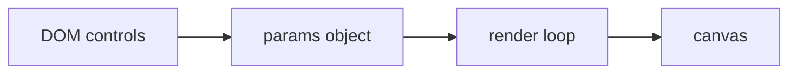
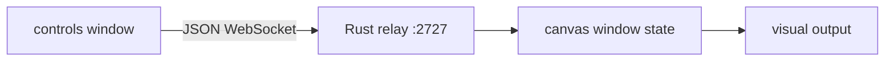

<p align="center">
  
</p>

<p align="center"><em>Baseline Tauri examples for creative graphics, live input, and developer experimentation</em></p>

---

# Junkpile

Junkpile is a developer library of small, inspectable Tauri applications for live visual work. Each project isolates one rendering or input architecture so developers can verify the baseline, understand the data flow, and then build a more specific idea without starting from an undocumented prototype.

The repository currently contains **22 examples**:

- **12 Tauri v1 projects**
- **10 Tauri v2 projects**
- single-window and two-window/WebSocket forms
- p5.js, raw WebGL, runtime-loaded GLSL, webcam processing, framebuffer feedback, MIDI, and OSC

## Important architectural truth

Every current example renders **inside the Tauri WebView**. The Tauri v2 projects are v2 ports of the browser/WebView architecture; they are **not** native `wgpu`, Metal, Vulkan, or DirectX surface examples.

That distinction matters:

```text
Current repository
HTML / JavaScript / p5.js / WebGL
              ↓
Tauri WebView
              ↓
OS web rendering stack

Not currently present
Rust wgpu renderer
              ↓
Native Metal / Vulkan / DX12 surface
```

A native GPU family can be added later as a separate baseline, but it should not be described as part of the current database until those projects exist and are tested.

## Web documentation

The repository includes a framework-free static documentation site:

- [`index.html`](index.html) — visual landing page, architectural overview, and filterable example browser
- [`docs.html`](docs.html) — layered developer documentation from first launch through deep architecture and extension guidance

Open either file directly or host the repository with GitHub Pages. The pages use only local CSS, JavaScript, images, and inline HTML diagrams. Rebuild them after changing `docs/examples.json` with:

```bash
python3 scripts/build_site.py
```

## Start here

1. Read [Development setup](docs/DEVELOPMENT.md).
2. Choose an example from the matrix below.
3. Open that example's local `README.md`.
4. Run `npm install` and `npm run dev` from the example directory.
5. Confirm the baseline before changing the visual or input path.

## Example matrix

| Project | Tauri | Baseline | Topology | Input |
|---|---|---|---|---|
| [p5-tauri-single-template](v1/p5-tauri-single-template/) | V1 | p5.js shader baseline | Single | DOM controls |
| [p5-tauri-ws-template](v1/p5-tauri-ws-template/) | V1 | p5.js shader baseline | Two-window WS | WebSocket controls |
| [p5-tauri-midi-template](v1/p5-tauri-midi-template/) | V1 | Rust MIDI bridge baseline | Single | MIDI + DOM controls |
| [p5-tauri-osc-template](v1/p5-tauri-osc-template/) | V1 | Rust OSC bridge baseline | Single | OSC + DOM controls |
| [webgl-tauri-v1-single-template](v1/webgl-tauri-v1-single-template/) | V1 | raw WebGL shader baseline | Single | DOM controls |
| [webgl-tauri-v1-ws-template](v1/webgl-tauri-v1-ws-template/) | V1 | raw WebGL shader baseline | Two-window WS | WebSocket controls |
| [glsl-tauri-v1-single-template](v1/glsl-tauri-v1-single-template/) | V1 | external GLSL file baseline | Single | DOM controls + shader file |
| [glsl-tauri-v1-ws-template](v1/glsl-tauri-v1-ws-template/) | V1 | external GLSL file baseline | Two-window WS | WebSocket controls + shader file |
| [webcam-tauri-v1-single-template](v1/webcam-tauri-v1-single-template/) | V1 | webcam processing baseline | Single | Webcam + DOM controls |
| [webcam-tauri-v1-ws-template](v1/webcam-tauri-v1-ws-template/) | V1 | webcam processing baseline | Two-window WS | Webcam + WebSocket controls |
| [feedback-tauri-v1-single-template](v1/feedback-tauri-v1-single-template/) | V1 | ping-pong feedback baseline | Single | Webcam + DOM controls |
| [feedback-tauri-v1-ws-template](v1/feedback-tauri-v1-ws-template/) | V1 | ping-pong feedback baseline | Two-window WS | Webcam + WebSocket controls |
| [p5-tauri-v2-single-template](v2/p5-tauri-v2-single-template/) | V2 | p5.js shader baseline | Single | DOM controls |
| [p5-tauri-v2-ws-template](v2/p5-tauri-v2-ws-template/) | V2 | p5.js shader baseline | Two-window WS | WebSocket controls |
| [webgl-tauri-v2-single-template](v2/webgl-tauri-v2-single-template/) | V2 | raw WebGL shader baseline | Single | DOM controls |
| [webgl-tauri-v2-ws-template](v2/webgl-tauri-v2-ws-template/) | V2 | raw WebGL shader baseline | Two-window WS | WebSocket controls |
| [glsl-tauri-v2-single-template](v2/glsl-tauri-v2-single-template/) | V2 | external GLSL file baseline | Single | DOM controls + shader file |
| [glsl-tauri-v2-ws-template](v2/glsl-tauri-v2-ws-template/) | V2 | external GLSL file baseline | Two-window WS | WebSocket controls + shader file |
| [webcam-tauri-v2-single-template](v2/webcam-tauri-v2-single-template/) | V2 | webcam processing baseline | Single | Webcam + DOM controls |
| [webcam-tauri-v2-ws-template](v2/webcam-tauri-v2-ws-template/) | V2 | webcam processing baseline | Two-window WS | Webcam + WebSocket controls |
| [feedback-tauri-v2-single-template](v2/feedback-tauri-v2-single-template/) | V2 | ping-pong feedback baseline | Single | Webcam + DOM controls |
| [feedback-tauri-v2-ws-template](v2/feedback-tauri-v2-ws-template/) | V2 | ping-pong feedback baseline | Two-window WS | Webcam + WebSocket controls |

## How the examples are organized

### Rendering families

| Family | What it isolates | Best starting point |
|---|---|---|
| p5 | p5.js WEBGL canvas, embedded GLSL, and uniform control | Developers who want the shortest path from sketch to desktop app |
| WebGL | Raw browser WebGL with explicit shader compilation and draw calls | Developers who want no graphics framework |
| GLSL | Raw WebGL with a separate runtime-loaded `.frag` file | Shader iteration, shader loaders, and future editor tooling |
| Webcam | MediaDevices capture, video texture upload, and real-time effects | Camera-reactive tools and installations |
| Feedback | Webcam-driven ping-pong framebuffers and persistent GPU state | Datamosh, trails, reaction-diffusion, and stateful systems |
| MIDI | Rust `midir` bridge to p5/GLSL parameters | Hardware controllers and performance instruments |
| OSC | Rust `rosc` UDP bridge to p5/GLSL parameters | TouchOSC, Max, Pure Data, SuperCollider, and network controllers |

### Window topologies

**Single-window examples** keep controls and the renderer in one document. Control handlers write directly into a shared JavaScript state object.



**Two-window examples** separate the interface and visual output. Both windows connect to a WebSocket relay embedded in the Rust process on port `2727`.



The relay is deliberately generic. Most new ideas can keep the Rust relay unchanged and define new message shapes in JavaScript.

## Tauri v1 and v2 in this repository

The visual frontends are intentionally similar across generations. The most important changes are in project structure and configuration:

| Concern | Tauri v1 | Tauri v2 |
|---|---|---|
| Config schema | `config/1` | `config/2` |
| Product metadata | `package` object | top-level fields |
| Window/security config | `tauri` object | `app` object |
| Static frontend path | `devPath` + `distDir` | `frontendDist` |
| Rust dependency | `tauri = "1"` with v1 features | `tauri = "2"` |
| Custom protocol feature | declared in project features | managed by v2 tooling/configuration |
| Current graphics path | WebView | WebView |

See [Tauri v1/v2 architecture](docs/V1_V2_ARCHITECTURE.md) for a field-by-field explanation.

## Documentation

- [Repository audit](docs/AUDIT.md)
- [Example matrix](docs/EXAMPLE_MATRIX.md)
- [Architecture guide](docs/ARCHITECTURE.md)
- [Tauri v1/v2 architecture](docs/V1_V2_ARCHITECTURE.md)
- [Development and platform setup](docs/DEVELOPMENT.md)
- [Troubleshooting](docs/TROUBLESHOOTING.md)
- [Adding a baseline or unique example](docs/ADDING_AN_EXAMPLE.md)
- [Documentation and commenting standard](docs/DOCUMENTATION_STANDARD.md)
- [Screenshot checklist](docs/SCREENSHOTS.md)
- [Roadmap](docs/ROADMAP.md)
- [Machine-readable example catalog](docs/examples.json)

Run `python3 scripts/audit_examples.py` to verify repository structure, Tauri major alignment, window assets, local references, and JavaScript syntax.

Every example also contains its own `README.md` with a local architecture diagram, run commands, code walkthrough, extension points, and troubleshooting notes.

## Known constraints

- The p5 examples load p5.js from cdnjs and therefore require a network connection unless the library is vendored.
- All WebSocket examples default to port `2727`; only one can own that port at a time.
- Camera examples depend on WebView/OS permission behavior and need platform testing before release.
- MIDI and OSC examples currently exist only for Tauri v1.
- Cross-platform compile and runtime status must be recorded after testing; a successful static review is not a substitute for running the app on macOS, Windows, and Linux.

## Project ethos

A useful example should be:

1. **Runnable** — a developer can install and launch it with a small number of commands.
2. **Isolated** — it demonstrates one architectural decision clearly.
3. **Commented** — the important path is explained next to the code.
4. **Documented** — setup, data flow, extension points, and limitations are visible before modification.
5. **Comparable** — v1/v2 and single/two-window pairs use consistent terminology.
6. **Expandable** — the baseline remains easy to copy into a new creative tool.

## License

MIT. See [LICENSE](LICENSE).
