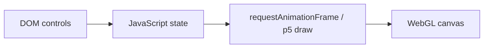
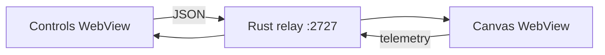
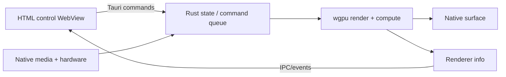
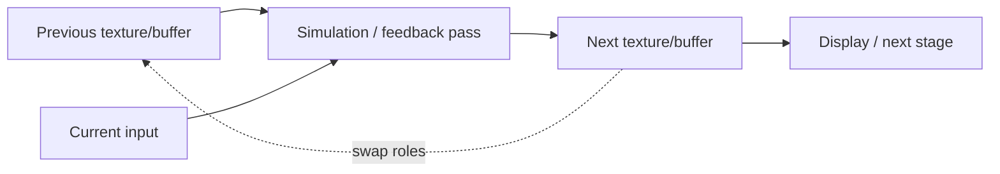

# Junkpile architecture

## 1. Executive model

Junkpile contains three complete architectural tracks rather than one renderer hidden behind different labels.

```mermaid
flowchart TB
  subgraph V1[Tauri v1 WebView · 00–25]
    V1I[DOM / camera / files / MIDI / OSC] --> V1S[JavaScript state]
    V1S --> V1R[p5.js / WebGL / GLSL]
    V1R --> V1W[WebView]
  end
  subgraph V2[Tauri v2 WebView · 00–25]
    V2I[DOM / camera / files / native plugins] --> V2S[JavaScript state + Tauri 2 IPC]
    V2S --> V2R[WebGL / GLSL]
    V2R --> V2W[WebView]
  end
  subgraph GPU[Native wgpu · 00–25]
    GI[HTML controls / native media / MIDI / OSC] --> GS[Rust canonical state]
    GS --> GR[wgpu render + compute graph]
    GR --> GB[Metal / Vulkan / DX12]
  end
```



## 2. Ownership rules

### WebView collections

JavaScript owns the animation loop, WebGL context, media elements, textures, framebuffers, and shader program. Rust owns Tauri startup and selected native integrations such as MIDI, OSC, filesystem access, dialogs, or the WebSocket relay.

### Native wgpu collection

Rust owns the instance, surface, adapter, device, queue, buffers, textures, bind groups, pipelines, command encoders, presentation, and resource recovery. An HTML controls window may exist, but it does not own the render surface.

## 3. Window topologies

### Single-window WebView



### Two-window WebSocket



Controls retain authoritative parameters. Canvas retains renderer-local media, decoder state, GPU textures, and temporal history. A renderer reconnect restores intent and settings; it does not magically preserve destroyed framebuffer history.

### Hybrid controls + native renderer



## 4. Rendering families

### p5.js WEBGL

Highest-level graphics baseline. p5 owns canvas creation, draw timing, shader setup, and uniform updates.

### Raw WebGL

Makes context creation, shader stages, program linking, vertex data, uniforms, viewport, textures, and draw calls explicit.

### External GLSL and shader playgrounds

Candidate source is compiled and linked separately. A replacement becomes active only after validation; failed candidates preserve the previous working program and surface the compiler log.

### Webcam and video textures

WebView projects use browser capture/media elements where appropriate. Native examples use platform capture bridges or FFmpeg. Both should upload only newly decoded frames and publish source/upload FPS separately from render FPS.

### Ping-pong temporal state



Read and write resources must remain distinct within the same pass. Clear and resize behavior must be explicit.

### Native render and compute graphs

The wgpu collection adds explicit pipeline layouts, bind groups, render targets, storage buffers, compute dispatch, dependencies, depth, backend selection, surface recovery, and readback alignment.

## 5. Control transport and state

- Coalesce high-rate UI input to no more than one send per animation frame.
- Serialize messages when order matters.
- Never let delayed telemetry overwrite a control while the user is dragging it.
- Use stable parameter identifiers rather than shader-location accidents.
- Preserve full state snapshots for reconnects.
- Distinguish persistent application state from transient media/GPU resources.

## 6. Media boundaries

### Camera and microphone

Enumerate at startup, keep refresh enabled before permission, request access, then enumerate again so labels populate.

### Native file paths and WebGL security

```text
Native path
  → Rust reads bytes
  → binary IPC response
  → Blob URL
  → browser decoder
  → WebGL texture
```

An `asset:` URL may display successfully yet still be blocked during WebGL upload.

### Latest-frame handoff

Native camera/video bridges should publish only the newest available frame through a bounded queue or latest-value slot. Allowing stale frames to accumulate increases latency and memory without improving output.

## 7. Export and recording

Large output should not cross IPC as one JSON value. Use bounded binary chunks, native files, or direct encoder pipes. wgpu readback must honor row alignment and strip padding before dense image assembly.

## 8. Platform model

- macOS: WKWebView + Metal; Syphon and native Apple capture paths are platform-specific.
- Windows: WebView2 + Direct3D 12; Spout remains a Windows-specific output path.
- Linux: WebKitGTK + Vulkan/GL depending on drivers and environment.

The architecture is cross-platform, but every device, codec, plugin, and packaging path requires explicit validation.