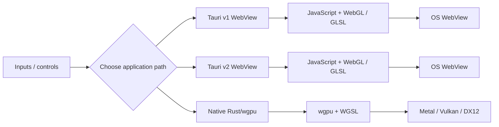
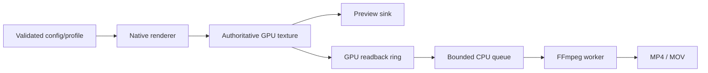
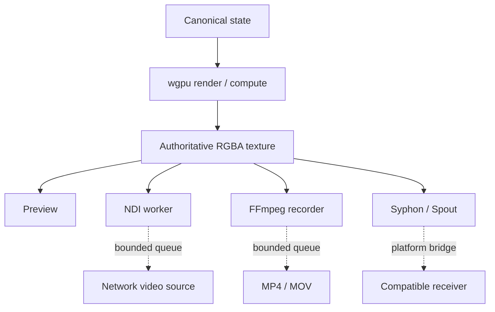
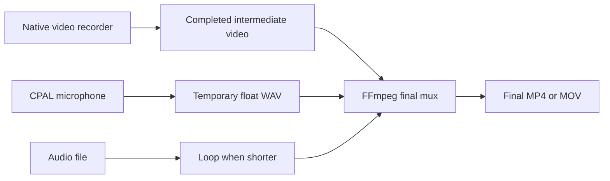

# Junkpile architecture

## 1. Purpose

Junkpile is a laboratory of standalone creative-application architectures. It intentionally keeps the implementation boundaries visible so a developer can understand where pixels, media, state, control, and output ownership live before combining systems.

The repository currently presents three complementary project tracks, but they should not be mistaken for three inseparable capability bundles. **Tauri generation, render ownership, and native/media I/O are separate architectural concerns.** They interact and some combinations have platform/framework constraints, but the presence of a transport in one track does not make that transport a renderer feature.

There are three complementary rendering paths:



Tauri generation and rendering path must be documented separately. In the current repository, `v1/` and `v2/` are WebView-rendered collections while `wgpu/` uses the Tauri 2 native-window path. A Tauri 2 application is still browser-rendered unless it explicitly creates and owns a native GPU surface.

## 2. Ownership model

### Tauri v1/v2 WebView

JavaScript generally owns:

- the animation loop
- WebGL context
- shader programs
- textures and framebuffers
- browser camera/audio/media elements
- DOM control state

Rust generally owns:

- Tauri startup
- native dialogs/filesystem hooks
- native MIDI or OSC bridges when used
- other native/platform integrations when an application needs them
- relay processes for split-window examples
- packaging and platform integration

This boundary matters: a WebView-rendered application is not limited to browser-only I/O simply because the WebView owns the pixels. Native services can still live in Rust; the project must define how rendered frames or control state cross that boundary.

### Native wgpu

Rust owns:

- `wgpu::Instance`
- adapter, device, queue
- native surface and presentation
- textures and buffers
- render and compute pipelines
- readback staging buffers
- native media workers
- output sink lifecycles

HTML controls are optional. When present, they edit state through Tauri IPC; they do not own the pixels.

## 3. Window topologies

### Single WebView

```text
DOM controls
    ↓
JavaScript state
    ↓
requestAnimationFrame / p5 draw
    ↓
WebGL canvas
```

### Split WebViews

```text
Controls WebView
    ↓ JSON / WebSocket
Rust relay
    ↓
Renderer WebView
    ↓
WebGL canvas
```

### Hybrid controls + native renderer

```text
Controls WebView
    ↓ Tauri command / event
Rust canonical state
    ↓
Native wgpu renderer
    ↓
OS GPU surface
```

This hybrid model is common in the native track because editor/UI flexibility and native render ownership remain independent.

## 4. Native wgpu progression

The native track is best understood as layers rather than a flat list.

### Layer A — surface and resource fundamentals

Examples 00–08 establish:

- adapter/backend selection
- surface configuration and recovery
- resize/fullscreen/HiDPI
- WGSL and uniform contracts
- Tauri control bridges
- texture upload
- ping-pong feedback
- multipass rendering
- render resolution independent from window size

### Layer B — compute and spatial systems

Examples 09–13 establish:

- compute storage buffers
- additive particle rendering
- 3D particle volumes
- raymarching
- GPU fluid-style simulation
- persistent voxel/volume feedback

### Layer C — native media and external control

Examples 14–20 establish:

- AVFoundation camera capture on macOS
- FFmpeg video decode
- audio analysis
- MIDI registry
- OSC routing
- interaction fields
- multi-input compositing

### Layer D — 3D assets and high-resolution output

Examples 21–25 establish:

- glTF scene loading
- skeletal animation
- manual pose inspection
- morph targets
- mesh feedback deformation
- tiled high-resolution still export

### Layer E — I/O contracts and recording

Examples 26–31 establish a reusable output architecture:



Important properties:

- preview dimensions can differ from recording dimensions
- output cadence can differ from renderer cadence
- mapped readback buffers obey wgpu row alignment
- CPU queues are bounded
- overload becomes drop/pressure telemetry instead of renderer stalls
- high-resolution recording validates GPU texture limits before allocation
- I/O profiles are parsed and validated before they can change the renderer

Example 29 is not present in the current tree. Later projects explicitly describe the earlier network-streaming implementation as quarantined and do not reuse it.

### Layer F — current wgpu interop and runtime routing references

Examples 32–41 explore:

- NDI
- presentation modes
- shader/config hot reload
- runtime state and structured logging
- simultaneous preview + NDI + recording
- Syphon on macOS
- Spout on Windows
- cross-platform output routing
- network output experiments
- unattended/appliance operation

The guiding principle in these wgpu examples remains one authoritative renderer with separable sinks. NDI, Syphon, Spout, FFmpeg, and similar transports are not wgpu features; this series is the current repository location where those sender/router contracts are demonstrated.



Example 40 is intentionally not considered a stable part of this output-router chain. The later router/appliance projects exclude the unresolved network worker.

### Layer G — native application counterparts

The newer native projects also revisit capabilities that already exist in the accessible WebView tracks:

- 42 — audio-reactive FFT
- 43 — A/V recorder
- 44 — WGSL shader playground

This is an important project direction: WebView examples remain useful for fast, accessible creative application development, while native wgpu counterparts expose higher-resolution, lower-level, and more GPU-centric implementations.

## 5. Authoritative frame and output sinks

The I/O series separates render ownership from output ownership.

A conceptual `VideoFrame`/frame descriptor contains the identity of one rendered frame: dimensions, frame index, timestamp, and access to the authoritative texture/view. Output sinks consume that frame through independent lifecycles.

A sink should be able to:

- start
- stop
- report status
- receive/reject a frame
- expose queue pressure and drops
- fail without taking ownership of the renderer

The exact interfaces evolve across examples, but the architectural direction is consistent from 27 onward.

## 6. Native file recording

The recording path developed incrementally:

```text
27 — frame/output contract
 ↓
28 — GPU readback + FFmpeg writer
 ↓
30 — true high-resolution recording
 ↓
31 — validated I/O profiles
 ↓
36/39 — simultaneous output routing
 ↓
43 — audio + final A/V mux
```

### Video path

```text
WGSL render
  ↓
authoritative texture
  ↓ optional scale/render at recording resolution
record texture
  ↓
texture-to-buffer copy
  ↓
mapped readback ring
  ↓
row padding removed
  ↓
reusable packed CPU frames
  ↓
bounded writer queue
  ↓
FFmpeg
```

### Audio/video finalization in Example 43



The current recorder supports video-only, microphone, or audio-file modes. During A/V finalization, the video stream is copied rather than re-encoded. H.264/MP4 uses AAC audio; ProRes/MOV uses 24-bit PCM audio.

## 7. Preview is a sink, not the source

From the high-resolution and I/O work onward, the visible native window should not be assumed to define output quality.

A project may render 4K/5K/8K-class output while showing a smaller preview. Presentation modes can fit, fill, stretch, display exact pixels, or hide the preview while the offscreen renderer and external outputs continue.

This distinction is essential for applications intended to scale to the highest sustainable GPU capability of the machine.

## 8. Current wgpu external-output reference paths

The following paths document how the present `wgpu/` examples connect their Rust-owned frame to external systems. They describe **current implementation choices**, not an architectural rule that these transports require wgpu. The current `v1/` and `v2/` collections do not contain dedicated NDI/Syphon/Spout sender examples; a WebView application would need its own renderer-to-native handoff.

### NDI

Typical path:

```text
wgpu texture
  → asynchronous readback
  → reusable BGRA CPU buffers
  → bounded worker
  → NDI sender
```

### Syphon (macOS)

Current example path:

```text
wgpu
  → CPU BGRA staging
  → reusable Metal texture
  → SyphonMetalServer
```

This is a compatibility path rather than a zero-copy wgpu/Metal share.

### Spout (Windows)

Current example path:

```text
wgpu
  → CPU BGRA staging
  → Direct3D 11 shared texture
  → Spout
```

Again, this establishes the sender lifecycle and cross-API bridge; it is not claimed to be zero-copy.

## 9. Runtime configuration and recoverability

Several later examples treat runtime configuration as a first-class system:

- typed JSON schemas
- unknown-field rejection
- platform overrides
- deep merge
- debounced file watching
- last-known-good configuration
- persistent runtime state
- explicit asset roots
- structured JSONL logs
- hidden/windowless operation
- health snapshots

This is what turns isolated rendering examples into reusable standalone-application infrastructure.

## 10. Status boundaries

Documentation should separate four ideas:

1. **Source exists** — project is in the tree.
2. **Static validation exists** — structure/config/source were checked.
3. **Build/runtime validation exists** — a named environment successfully ran the path.
4. **Cross-platform validation exists** — behavior was verified on multiple operating systems.

Do not collapse these into one generic “stable” label.

Current important exceptions:

- Example 29: not present; later projects call the earlier network-streaming implementation quarantined.
- Example 40: network-output experiment retained but unresolved/under review.
- Syphon: macOS-specific.
- Spout: Windows-specific.
- NDI: requires external SDK/runtime support.

## 11. How to extend Junkpile

When adding a new capability:

1. Start from the smallest accepted project that already owns the relevant boundary.
2. Keep renderer state canonical in one place.
3. Give external workers bounded queues.
4. Make failure visible through diagnostics.
5. Preserve a working preview even when an output sink fails, when architecture permits.
6. Document platform dependencies and evidence level.
7. Add a new example only when it teaches a genuinely distinct capability rather than duplicating an existing control path.

The goal is not one universal application. The goal is a transparent stack from which many focused standalone creative applications can be built.
