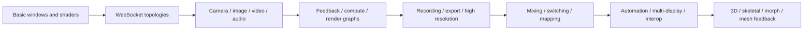

# Junkpile advancements and modernization retrospective — July 2026

## Executive result

Junkpile advanced from a 22-project WebView-only snapshot to a complete **78-project reference library**:

- 26 Tauri v1 WebView examples
- 26 Tauri v2 WebView examples
- 26 native Rust/wgpu examples

The work was not merely additive. Early projects were revisited so the entire collection now shares clearer interfaces, diagnostics, lifecycle behavior, standalone build paths, and documentation.

## Development progression

## Major additions

### Media pathways

The collections now cover browser and native camera capture, image loading, browser video textures, native FFmpeg video decoding, microphone FFT, audio-file analysis, image sequences, overlays, and generated/calibration sources.

### Temporal and GPU systems

Feedback progressed from WebGL ping-pong framebuffers to native HDR textures, compute fluid simulation, persistent storage-buffer mesh deformation, and explicit render graphs.

### Live operation

The later WebView examples introduced Preview/Program switching, keying, overlays, projection mapping, multi-display output, recording, transport, and output routing. These move the repository from isolated visual sketches toward real application architecture.

### Native GPU depth

The wgpu track now includes backend selection, high-resolution targets, compute particles, volumetric raymarching, fluid simulation, native camera/video, MIDI/OSC, gesture fields, multi-input composition, glTF, skeletal poses, morph targets, mesh feedback, and tiled 8K export.

## Reliability lessons

### Scroll from the first frame

Grid and flex children frequently require `min-height: 0`. A layout that becomes scrollable only after resizing is structurally broken.

### High-rate controls need backpressure

One IPC/WebSocket message for every tiny slider event creates jumpiness and stale telemetry. Coalesce to one send per animation frame, serialize where needed, and keep active UI controls authoritative while dragged.

### Failed shader replacements must be non-destructive

Compile and link a candidate separately. Activate it only on success. Preserve the last working program and display the full compiler/linker log.

### Media permission is a state machine

Device lists can be empty or unlabeled before permission. Refresh must remain possible before access, and enumeration must run again after permission.

### Renderer state and resource state differ

A reconnect can restore parameters, transport intent, and device choice. It cannot preserve a destroyed framebuffer, decoder, stream, or GPU buffer. Reinitialize temporal resources explicitly.

### Browser paths are not native paths

Tauri native drag/drop and file access require current Tauri APIs. A URL that displays in an `` can still be tainted for WebGL texture upload; Rust byte reads and Blob URLs are the safe route.

### Large output belongs near native storage and encoders

Do not serialize 4K frames or recordings into one enormous JSON IPC message. Use bounded chunks, direct files, encoder pipes, and explicit progress/error states.

## What this means for application design

Junkpile now proves that a developer can choose a narrow starting point—keyer, recorder, feedback unit, router, playback tool, projection mapper, automation engine—and still reuse a common conceptual foundation. This supports the long-term Scheng model: broad shared engine capability beneath deliberately focused standalone instruments.
