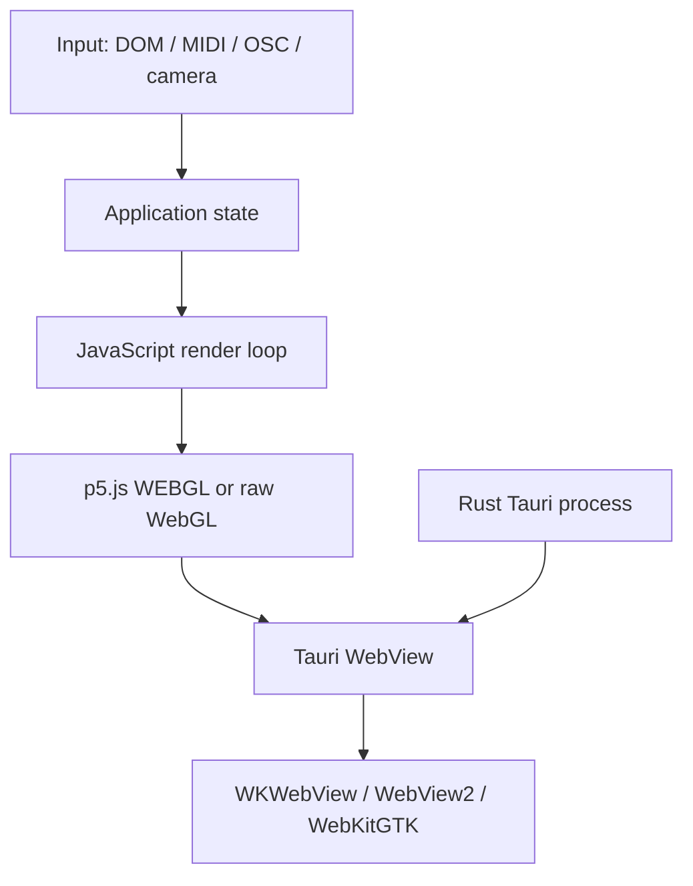
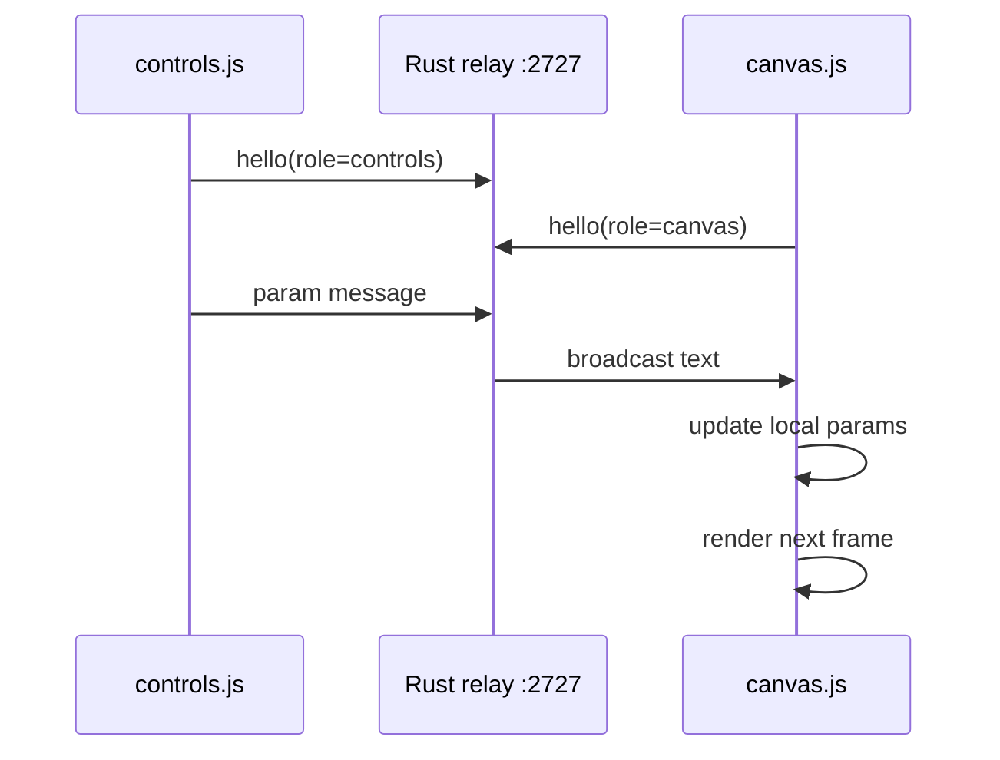
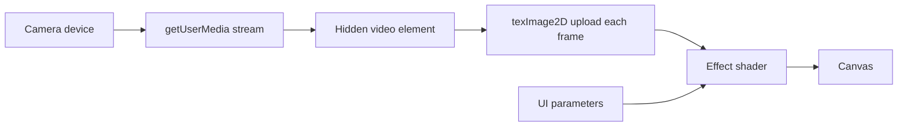
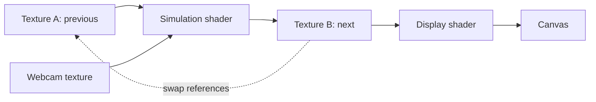

# Architecture guide

## 1. The layers shared by every project



The repository is deliberately WebView-first. Rust creates the application, owns native integrations when needed, and hosts the relay in the two-window examples. JavaScript owns the visual render loop.

## 2. Single-window state architecture

A single-window project has one JavaScript context. There is no transport layer between the controls and renderer.

```mermaid
sequenceDiagram
  participant User
  participant DOM as HTML control
  participant Params as params object
  participant Loop as draw()/render()
  participant GPU as WebGL
  User->>DOM: move slider
  DOM->>Params: write value
  Loop->>Params: read current state
  Loop->>GPU: upload uniforms and draw
```

Advantages:

- minimal code and latency
- easiest baseline to understand
- no synchronization or reconnection behavior

Tradeoff:

- controls and output cannot be independently placed on different displays without restructuring the app

## 3. Two-window WebSocket architecture

The two-window projects create `controls` and `canvas` windows in `tauri.conf.json`. A Rust task binds loopback port `2727`. Each WebView connects as a WebSocket client and identifies its role with a hello message.



The relay broadcasts text to every other client. Binary messages are routed only to clients whose role is `canvas`. This leaves room for later frame, audio, or binary-control experiments without changing the basic connection model.

### Port behavior

- The port is fixed at `2727` in the current examples.
- Running two WS examples simultaneously creates a bind conflict.
- Change the Rust `PORT` constant and the JavaScript `WS_URL` together.
- Both IPv4 (`127.0.0.1`) and IPv6 (`::1`) listeners are attempted.

## 4. Rendering families

### p5.js WEBGL

p5 creates the canvas, compiles embedded shader strings, runs the animation loop, and exposes `setUniform()`. This is the highest-level graphics baseline.

### Raw WebGL

The raw WebGL family makes the browser API explicit:

1. request the context
2. compile shader stages
3. link a program
4. create a full-screen quad buffer
5. locate and upload uniforms
6. draw with `gl.drawArrays()`
7. resize the canvas and viewport

### Runtime-loaded GLSL

The GLSL family keeps fragment source in `shader.frag`. It adds file loading, runtime compilation, and error reporting. In the WS form, the controls page sends source text to the canvas page.

### Webcam texture processing



The camera is acquired by JavaScript inside the WebView. Rust does not capture frames in these examples.

### Ping-pong feedback

A texture cannot safely be sampled while it is also the active render target. The feedback family solves this with two framebuffer textures.



On the next frame, the roles reverse. Resizing recreates the framebuffer textures and therefore resets accumulated state.

## 5. Native input bridges

### MIDI

Rust uses `midir` because Web MIDI support inside desktop WebViews is inconsistent. Rust owns enumeration and connection state, parses message bytes, and emits a structured event to JavaScript.

### OSC

Rust binds a UDP socket with Tokio, decodes packets through `rosc`, and emits messages to JavaScript. JavaScript owns the address-to-parameter mapping so creative mappings can change without rebuilding Rust.

## 6. Where to add new technology families

A new baseline should be a sibling folder under `v1` or `v2`, not a hidden mode inside an unrelated project. Good candidates include:

- native wgpu surface rendering
- WebGPU inside the WebView
- Syphon/Spout texture sharing
- NDI input/output
- audio analysis and FFT
- gamepad/HID
- serial/Arduino
- screen capture
- video file decode and timeline control

Each should begin as a baseline before receiving a unique artistic behavior.
