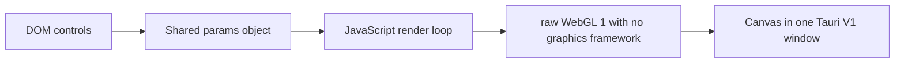

# Raw WebGL Shader · Tauri v1 · Single Window

> **Baseline:** raw WebGL shader baseline  
> **Tauri:** 1.x  
> **Window topology:** single window  
> **Input:** DOM controls  
> **Renderer:** raw WebGL 1 with no graphics framework

## Purpose

The same parameterized shader idea as the p5 baseline, but implemented directly with the browser WebGL API. It makes context creation, shader compilation, program linking, buffer setup, uniform lookup, drawing, and resize behavior explicit.

This example is intentionally a baseline: it exposes the complete path from input to pixels without introducing an application-specific product architecture. Start here, confirm the baseline works, then replace the visual or input mapping with your own idea.

## What you should learn

- Acquire a WebGL context with `canvas.getContext("webgl")`.
- Compile and link GLSL stages without a helper framework.
- Render a full-screen quad with `gl.drawArrays()` and `requestAnimationFrame()`.
- Manage canvas pixel dimensions and the WebGL viewport during resize.

## Architecture



### Runtime data flow

1. The HTML creates the controls and canvas layout in one WebView document.
2. Input handlers write directly into the shared `params` object.
3. The JavaScript compiles the embedded shaders, links a WebGL program, and creates a full-screen quad buffer.
4. `requestAnimationFrame()` uploads uniforms and calls `gl.drawArrays()` each frame.

## Prerequisites

1. Install the operating-system dependencies required by Tauri.
2. Install a current Rust toolchain with `rustup`.
3. Install Node.js and npm.
4. Install project dependencies from this directory.

```bash
npm install
npm run dev
```

Build an installable application with:

```bash
npm run build
```

## Controls and inputs

`hue`, `saturation`, `brightness`, `zoom`, `speed`, `distortion`, `complexity`, `symmetry`, `glow`, `invert`, `pulse`, and `rotate`.

The HTML control defaults and the JavaScript `params` defaults are intended to match. When adding a parameter, update both so a fresh launch and the first user interaction produce the same state.

## File map

| File | Responsibility |
|---|---|
| `package.json` | Node scripts and the project-local Tauri CLI version. |
| `src/index.html` | Single-window controls, canvas layout, and script loading. |
| `src/sketch.js` | Visual state, shaders, rendering loop, and UI/input integration. |
| `src-tauri/Cargo.toml` | Rust package metadata and native dependencies. |
| `src-tauri/build.rs` | Project metadata or source file. |
| `src-tauri/src/main.rs` | Tauri entry point. |
| `src-tauri/tauri.conf.json` | Tauri 1 window, frontend, security, and bundle configuration. |

Generated schemas, icon assets, and lock files are omitted from this table because they do not define the example's runtime architecture.

## Tauri 1.x notes

This project uses Tauri 1: `tauri = "1"`, the v1 configuration schema, `build.devPath`/`build.distDir`, and the v1 `tauri` configuration object. The visual pipeline still runs inside the WebView; Tauri 2 does not make this example a native wgpu renderer.

Read [`../../docs/V1_V2_ARCHITECTURE.md`](../../docs/V1_V2_ARCHITECTURE.md) for the repository-wide comparison.

## Extending the example

1. Edit the embedded `FRAG_SHADER` string in the rendering JavaScript file.
2. Add uniforms by updating the shader, parameter state, and `setUniform()` calls.
3. Use this family when a developer needs WebGL transparency without p5 abstractions.

Before adding a unique behavior, preserve a runnable baseline commit or branch. This makes it possible to distinguish framework/integration failures from failures introduced by the new visual idea.

## Troubleshooting

| Symptom | Check |
|---|---|
| App does not start | Confirm the OS-specific Tauri prerequisites, run `npm install`, then run `npm run dev` from this project directory. |
| Blank or frozen canvas | Open the WebView developer tools, check shader compiler output, and confirm WebGL is available. |

## Screenshot placeholder

Add a screenshot after the example has been run on a target platform:

```text
docs/images/webgl-tauri-v1-single-template.png
```

Then replace this section with:

```markdown

```

## Related examples

- Browse the complete comparison in [`../../docs/EXAMPLE_MATRIX.md`](../../docs/EXAMPLE_MATRIX.md).
- Use the paired Tauri 2 version to compare framework-generation changes.
- Use the paired two-window version to compare direct state with transport-based state.
