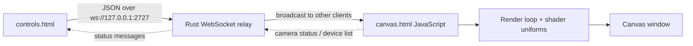

# External GLSL Shader · Tauri v1 · Two-Window WebSocket

> **Baseline:** external GLSL file baseline  
> **Tauri:** 1.x  
> **Window topology:** two windows with an embedded WebSocket relay  
> **Input:** WebSocket controls + shader file  
> **Renderer:** raw WebGL 1 with a fragment shader loaded from `shader.frag`

## Purpose

A raw WebGL baseline that separates the artwork into an editable `.frag` file. The app loads, compiles, and reports shader errors at runtime; the two-window form can also send replacement shader source from the controls window.

This example is intentionally a baseline: it exposes the complete path from input to pixels without introducing an application-specific product architecture. Start here, confirm the baseline works, then replace the visual or input mapping with your own idea.

## What you should learn

- Fetch a shader asset from the Tauri frontend bundle.
- Compile replacement shader source at runtime and preserve the last valid program on failure.
- Surface GLSL compiler messages in the interface.
- Keep shader source separate from application and transport code.

## Architecture



### Runtime data flow

1. `controls.js` serializes state changes as JSON messages.
2. Rust `main.rs` hosts the loopback WebSocket relay and broadcasts messages to other connected clients.
3. `canvas.js` receives messages, updates local state, and owns the visual render loop.
4. The JavaScript fetches `shader.frag`, compiles it, and reports compiler errors without discarding the last valid program.
5. The rendering path uploads the documented uniform contract on every frame.

## Prerequisites

1. Install the operating-system dependencies required by Tauri.
2. Install a current Rust toolchain with `rustup`.
3. Install Node.js and npm.
4. Install project dependencies from this directory.

```bash
npm install
npm run dev
```

Build an installable application with:

```bash
npm run build
```

## Controls and inputs

Shader file loading plus `hue`, `saturation`, `brightness`, `zoom`, `speed`, `distortion`, `complexity`, `symmetry`, `glow`, `invert`, `pulse`, and `rotate`.

The HTML control defaults and the JavaScript `params` defaults are intended to match. When adding a parameter, update both so a fresh launch and the first user interaction produce the same state.

## File map

| File | Responsibility |
|---|---|
| `package.json` | Node scripts and the project-local Tauri CLI version. |
| `src/canvas.html` | Output-window canvas and status overlay. |
| `src/canvas.js` | Output-window state receiver and rendering pipeline. |
| `src/controls.html` | Control-window markup and styling. |
| `src/controls.js` | Control-window state serialization and WebSocket client. |
| `src/shader.frag` | Runtime-loaded GLSL ES 1.0 fragment shader. |
| `src-tauri/Cargo.toml` | Rust package metadata and native dependencies. |
| `src-tauri/build.rs` | Project metadata or source file. |
| `src-tauri/src/main.rs` | Tauri entry point and embedded WebSocket relay. |
| `src-tauri/tauri.conf.json` | Tauri 1 window, frontend, security, and bundle configuration. |

Generated schemas, icon assets, and lock files are omitted from this table because they do not define the example's runtime architecture.

## Tauri 1.x notes

This project uses Tauri 1: `tauri = "1"`, the v1 configuration schema, `build.devPath`/`build.distDir`, and the v1 `tauri` configuration object. The embedded WebSocket relay design is intentionally the same in both generations; most migration differences are configuration and dependency changes.

Read [`../../docs/V1_V2_ARCHITECTURE.md`](../../docs/V1_V2_ARCHITECTURE.md) for the repository-wide comparison.

## Extending the example

1. Replace `src/shader.frag` while preserving the documented uniform contract.
2. Change the uniform contract only after updating the JavaScript upload path.
3. Use the compile-error overlay as the starting point for a richer shader editor.

Before adding a unique behavior, preserve a runnable baseline commit or branch. This makes it possible to distinguish framework/integration failures from failures introduced by the new visual idea.

## Troubleshooting

| Symptom | Check |
|---|---|
| App does not start | Confirm the OS-specific Tauri prerequisites, run `npm install`, then run `npm run dev` from this project directory. |
| Blank or frozen canvas | Open the WebView developer tools, check shader compiler output, and confirm WebGL is available. |
| Controls remain disconnected | Confirm no other template is using TCP port 2727. Check the Rust console for IPv4/IPv6 listener errors. |
| Canvas opens but does not update | Verify both pages send the hello handshake and that `WS_URL` matches the Rust `PORT` constant. |
| Replacement shader fails | Read the compiler overlay and preserve the expected uniform names and GLSL ES 1.0 syntax. |

## Screenshot placeholder

Add a screenshot after the example has been run on a target platform:

```text
docs/images/glsl-tauri-v1-ws-template.png
```

Then replace this section with:

```markdown

```

## Related examples

- Browse the complete comparison in [`../../docs/EXAMPLE_MATRIX.md`](../../docs/EXAMPLE_MATRIX.md).
- Use the paired Tauri 2 version to compare framework-generation changes.
- Use the paired single-window version to compare direct state with transport-based state.
