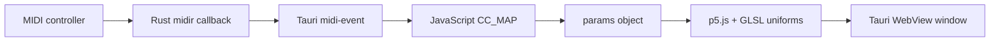

# p5.js + MIDI · Tauri v1 · Single Window

> **Baseline:** Rust MIDI bridge baseline  
> **Tauri:** 1.x  
> **Window topology:** single window  
> **Input:** MIDI + DOM controls  
> **Renderer:** p5.js WEBGL shader with native MIDI input handled by Rust `midir`

## Purpose

A Tauri v1 hardware-input baseline. Rust enumerates and opens MIDI ports, parses incoming bytes, and emits normalized events to the WebView. JavaScript maps those events to shader parameters while retaining manual controls.

This example is intentionally a baseline: it exposes the complete path from input to pixels without introducing an application-specific product architecture. Start here, confirm the baseline works, then replace the visual or input mapping with your own idea.

## What you should learn

- Expose Rust MIDI functions as Tauri commands.
- Keep a native MIDI connection alive in managed Rust state.
- Parse CC, note, and pitch-bend messages.
- Emit events from Rust and subscribe through `window.__TAURI__.event`.

## Architecture



### Runtime data flow

1. The HTML creates the controls and canvas layout in one WebView document.
2. Input handlers write directly into the shared `params` object.
3. Rust commands enumerate and connect ports; a callback parses MIDI bytes.
4. Rust emits structured events and JavaScript maps them into the shared shader parameters.

## Prerequisites

1. Install the operating-system dependencies required by Tauri.
2. Install a current Rust toolchain with `rustup`.
3. Install Node.js and npm.
4. Install project dependencies from this directory.

```bash
npm install
npm run dev
```

Build an installable application with:

```bash
npm run build
```

> The p5 examples load p5.js from cdnjs. A network connection is required unless you vendor `p5.min.js` locally and update the script tag.

## Controls and inputs

MIDI port refresh/connect/disconnect/debug, manual `hue`, `zoom`, `speed`, and `brightness`, plus the CC map defined in `sketch.js`.

The HTML control defaults and the JavaScript `params` defaults are intended to match. When adding a parameter, update both so a fresh launch and the first user interaction produce the same state.

## File map

| File | Responsibility |
|---|---|
| `package.json` | Node scripts and the project-local Tauri CLI version. |
| `src/index.html` | Single-window controls, canvas layout, and script loading. |
| `src/sketch.js` | Visual state, shaders, rendering loop, and UI/input integration. |
| `src-tauri/Cargo.toml` | Rust package metadata and native dependencies. |
| `src-tauri/build.rs` | Project metadata or source file. |
| `src-tauri/src/main.rs` | Tauri commands, MIDI connection state, parser, and event emission. |
| `src-tauri/tauri.conf.json` | Tauri 1 window, frontend, security, and bundle configuration. |

Generated schemas, icon assets, and lock files are omitted from this table because they do not define the example's runtime architecture.

## Tauri 1.x notes

This project uses Tauri 1: `tauri = "1"`, the v1 configuration schema, `build.devPath`/`build.distDir`, and the v1 `tauri` configuration object. The visual pipeline still runs inside the WebView; Tauri 2 does not make this example a native wgpu renderer.

Read [`../../docs/V1_V2_ARCHITECTURE.md`](../../docs/V1_V2_ARCHITECTURE.md) for the repository-wide comparison.

## Extending the example

1. Edit `CC_MAP` in `src/sketch.js` for a controller-specific layout.
2. Extend `parse_midi()` in Rust when additional MIDI message types are needed.
3. Add a Tauri v2 counterpart by migrating commands/events and defining the required v2 capabilities.

Before adding a unique behavior, preserve a runnable baseline commit or branch. This makes it possible to distinguish framework/integration failures from failures introduced by the new visual idea.

## Troubleshooting

| Symptom | Check |
|---|---|
| App does not start | Confirm the OS-specific Tauri prerequisites, run `npm install`, then run `npm run dev` from this project directory. |
| Blank or frozen canvas | Open the WebView developer tools, check shader compiler output, and confirm WebGL is available. |
| No MIDI ports appear | Verify the device at the operating-system level; on macOS check Audio MIDI Setup, and on Linux ensure ALSA development/runtime support is present. |

## Screenshot placeholder

Add a screenshot after the example has been run on a target platform:

```text
docs/images/p5-tauri-midi-template.png
```

Then replace this section with:

```markdown

```

## Related examples

- Browse the complete comparison in [`../../docs/EXAMPLE_MATRIX.md`](../../docs/EXAMPLE_MATRIX.md).
- Use the paired Tauri 2 version to compare framework-generation changes.
- Use the paired two-window version to compare direct state with transport-based state.
