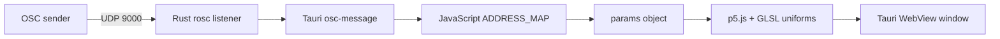

# p5.js + OSC · Tauri v1 · Single Window

> **Baseline:** Rust OSC bridge baseline  
> **Tauri:** 1.x  
> **Window topology:** single window  
> **Input:** OSC + DOM controls  
> **Renderer:** p5.js WEBGL shader with OSC UDP input handled by Rust `rosc`

## Purpose

A Tauri v1 network-control baseline. A Tokio UDP task decodes OSC packets in Rust and emits messages into the WebView, where an address map scales values into the shader parameter ranges.

This example is intentionally a baseline: it exposes the complete path from input to pixels without introducing an application-specific product architecture. Start here, confirm the baseline works, then replace the visual or input mapping with your own idea.

## What you should learn

- Bind an OSC UDP listener inside the Tauri process.
- Decode OSC messages and bundles with `rosc`.
- Forward normalized messages from Rust to JavaScript.
- Map controller-friendly 0–1 values into visual parameter ranges.

## Architecture



### Runtime data flow

1. The HTML creates the controls and canvas layout in one WebView document.
2. Input handlers write directly into the shared `params` object.
3. A Tokio task receives UDP packets and recursively handles OSC messages or bundles.
4. Rust emits decoded data and JavaScript scales mapped addresses into shader parameters.

## Prerequisites

1. Install the operating-system dependencies required by Tauri.
2. Install a current Rust toolchain with `rustup`.
3. Install Node.js and npm.
4. Install project dependencies from this directory.

```bash
npm install
npm run dev
```

Build an installable application with:

```bash
npm run build
```

> The p5 examples load p5.js from cdnjs. A network connection is required unless you vendor `p5.min.js` locally and update the script tag.

## Controls and inputs

OSC addresses `/hue`, `/zoom`, `/speed`, `/brightness`, `/distortion`, `/complexity`, `/invert`, and `/pulse`, plus matching manual controls.

The HTML control defaults and the JavaScript `params` defaults are intended to match. When adding a parameter, update both so a fresh launch and the first user interaction produce the same state.

## File map

| File | Responsibility |
|---|---|
| `package.json` | Node scripts and the project-local Tauri CLI version. |
| `src/index.html` | Single-window controls, canvas layout, and script loading. |
| `src/sketch.js` | Visual state, shaders, rendering loop, and UI/input integration. |
| `src-tauri/Cargo.toml` | Rust package metadata and native dependencies. |
| `src-tauri/build.rs` | Project metadata or source file. |
| `src-tauri/src/main.rs` | OSC UDP listener, packet dispatch, and Tauri event emission. |
| `src-tauri/tauri.conf.json` | Tauri 1 window, frontend, security, and bundle configuration. |

Generated schemas, icon assets, and lock files are omitted from this table because they do not define the example's runtime architecture.

## Tauri 1.x notes

This project uses Tauri 1: `tauri = "1"`, the v1 configuration schema, `build.devPath`/`build.distDir`, and the v1 `tauri` configuration object. The visual pipeline still runs inside the WebView; Tauri 2 does not make this example a native wgpu renderer.

Read [`../../docs/V1_V2_ARCHITECTURE.md`](../../docs/V1_V2_ARCHITECTURE.md) for the repository-wide comparison.

## Extending the example

1. Edit `ADDRESS_MAP` in `src/sketch.js` to add or remap addresses.
2. Change the UDP port in Rust and update any sender configuration.
3. Add sender validation or network binding configuration before exposing the port beyond loopback/LAN use.

Before adding a unique behavior, preserve a runnable baseline commit or branch. This makes it possible to distinguish framework/integration failures from failures introduced by the new visual idea.

## Troubleshooting

| Symptom | Check |
|---|---|
| App does not start | Confirm the OS-specific Tauri prerequisites, run `npm install`, then run `npm run dev` from this project directory. |
| Blank or frozen canvas | Open the WebView developer tools, check shader compiler output, and confirm WebGL is available. |
| No OSC messages appear | Confirm the sender targets UDP port 9000 and uses the address names listed above. Check firewall and host/IP settings. |

## Screenshot placeholder

Add a screenshot after the example has been run on a target platform:

```text
docs/images/p5-tauri-osc-template.png
```

Then replace this section with:

```markdown

```

## Related examples

- Browse the complete comparison in [`../../docs/EXAMPLE_MATRIX.md`](../../docs/EXAMPLE_MATRIX.md).
- Use the paired Tauri 2 version to compare framework-generation changes.
- Use the paired two-window version to compare direct state with transport-based state.
