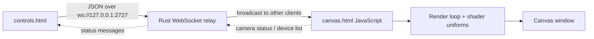

# p5.js Shader · Tauri v2 · Two-Window WebSocket

> **Baseline:** p5.js shader baseline  
> **Tauri:** 2.x  
> **Window topology:** two windows with an embedded WebSocket relay  
> **Input:** WebSocket controls  
> **Renderer:** p5.js in WEBGL mode, backed by the WebView WebGL implementation

## Purpose

A compact baseline for rendering a full-window GLSL fragment shader through p5.js. It keeps the shader pipeline approachable while exposing the state, uniform, and control wiring developers need to replace the visual with their own work.

This example is intentionally a baseline: it exposes the complete path from input to pixels without introducing an application-specific product architecture. Start here, confirm the baseline works, then replace the visual or input mapping with your own idea.

## What you should learn

- Create a p5.js `WEBGL` canvas inside a Tauri WebView.
- Compile embedded vertex and fragment shader strings with `createShader()`.
- Map HTML controls to a shared parameter object and upload uniforms each frame.
- Use a fixed-bound loop with an early exit for WebGL 1 / GLSL ES 1.0 compatibility.

## Architecture



### Runtime data flow

1. `controls.js` serializes state changes as JSON messages.
2. Rust `main.rs` hosts the loopback WebSocket relay and broadcasts messages to other connected clients.
3. `canvas.js` receives messages, updates local state, and owns the visual render loop.
4. The p5 `setup()` function creates the WEBGL canvas and compiles the shader.
5. The p5 `draw()` function uploads uniforms and draws a full-screen rectangle each frame.

## Prerequisites

1. Install the operating-system dependencies required by Tauri.
2. Install a current Rust toolchain with `rustup`.
3. Install Node.js and npm.
4. Install project dependencies from this directory.

```bash
npm install
npm run dev
```

Build an installable application with:

```bash
npm run build
```

> The p5 examples load p5.js from cdnjs. A network connection is required unless you vendor `p5.min.js` locally and update the script tag.

## Controls and inputs

`hue`, `saturation`, `brightness`, `zoom`, `speed`, `distortion`, `complexity`, `symmetry`, `glow`, `invert`, `pulse`, and `rotate`.

The HTML control defaults and the JavaScript `params` defaults are intended to match. When adding a parameter, update both so a fresh launch and the first user interaction produce the same state.

## File map

| File | Responsibility |
|---|---|
| `package.json` | Node scripts and the project-local Tauri CLI version. |
| `src/canvas.html` | Output-window canvas and status overlay. |
| `src/canvas.js` | Output-window state receiver and rendering pipeline. |
| `src/controls.html` | Control-window markup and styling. |
| `src/controls.js` | Control-window state serialization and WebSocket client. |
| `src-tauri/Cargo.toml` | Rust package metadata and native dependencies. |
| `src-tauri/build.rs` | Project metadata or source file. |
| `src-tauri/src/main.rs` | Tauri entry point and embedded WebSocket relay. |
| `src-tauri/tauri.conf.json` | Tauri 2 window, frontend, security, and bundle configuration. |

Generated schemas, icon assets, and lock files are omitted from this table because they do not define the example's runtime architecture.

## Tauri 2.x notes

This project uses Tauri 2: `tauri = "2"`, the v2 configuration schema, top-level product metadata, `build.frontendDist`, and the v2 `app` configuration object. The embedded WebSocket relay design is intentionally the same in both generations; most migration differences are configuration and dependency changes.

Read [`../../docs/V1_V2_ARCHITECTURE.md`](../../docs/V1_V2_ARCHITECTURE.md) for the repository-wide comparison.

## Extending the example

1. Edit `FRAG_SHADER` in the rendering JavaScript file.
2. Add a control in the HTML, a default in `params`, and a matching uniform upload.
3. Replace the CDN p5.js dependency with a vendored copy when offline operation is required.

Before adding a unique behavior, preserve a runnable baseline commit or branch. This makes it possible to distinguish framework/integration failures from failures introduced by the new visual idea.

## Troubleshooting

| Symptom | Check |
|---|---|
| App does not start | Confirm the OS-specific Tauri prerequisites, run `npm install`, then run `npm run dev` from this project directory. |
| Blank or frozen canvas | Open the WebView developer tools, check shader compiler output, and confirm WebGL is available. |
| Controls remain disconnected | Confirm no other template is using TCP port 2727. Check the Rust console for IPv4/IPv6 listener errors. |
| Canvas opens but does not update | Verify both pages send the hello handshake and that `WS_URL` matches the Rust `PORT` constant. |

## Screenshot placeholder

Add a screenshot after the example has been run on a target platform:

```text
docs/images/p5-tauri-v2-ws-template.png
```

Then replace this section with:

```markdown

```

## Related examples

- Browse the complete comparison in [`../../docs/EXAMPLE_MATRIX.md`](../../docs/EXAMPLE_MATRIX.md).
- Use the paired Tauri 1 version to compare framework-generation changes.
- Use the paired single-window version to compare direct state with transport-based state.
