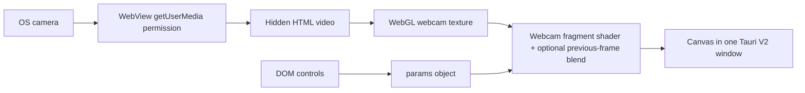

# Webcam Processing · Tauri v2 · Single Window

> **Baseline:** webcam processing baseline  
> **Tauri:** 2.x  
> **Window topology:** single window  
> **Input:** Webcam + DOM controls  
> **Renderer:** raw WebGL 1 using the browser MediaDevices API and a webcam texture

## Purpose

A baseline for camera acquisition, device selection, video-frame upload, shader processing, and lightweight previous-frame blending. It demonstrates the boundary between OS camera permission, WebView media capture, JavaScript video handling, and GPU texture sampling.

This example is intentionally a baseline: it exposes the complete path from input to pixels without introducing an application-specific product architecture. Start here, confirm the baseline works, then replace the visual or input mapping with your own idea.

## What you should learn

- Enumerate cameras with `navigator.mediaDevices.enumerateDevices()`.
- Request a stream with `getUserMedia()` and attach it to a hidden video element.
- Upload video frames into a WebGL texture every animation frame.
- Apply real-time effects and optional previous-frame feedback in a fragment shader.

## Architecture



### Runtime data flow

1. The HTML creates the controls and canvas layout in one WebView document.
2. Input handlers write directly into the shared `params` object.
3. The camera stream feeds a hidden video element.
4. Each frame uploads the current video image into a WebGL texture before drawing the selected effect.

## Prerequisites

1. Install the operating-system dependencies required by Tauri.
2. Install a current Rust toolchain with `rustup`.
3. Install Node.js and npm.
4. Install project dependencies from this directory.

```bash
npm install
npm run dev
```

Build an installable application with:

```bash
npm run build
```

> The first camera start triggers an operating-system/WebView permission request. Packaged apps may also require platform permission metadata; the included macOS entitlement file is the starting point.

## Controls and inputs

Camera selection and start/stop, effect mode, `distortion`, `feedback`, `zoom`, `speed`, `hue`, `saturation`, `brightness`, `contrast`, `mirror`, `invert`, and `greyscale`.

The HTML control defaults and the JavaScript `params` defaults are intended to match. When adding a parameter, update both so a fresh launch and the first user interaction produce the same state.

## File map

| File | Responsibility |
|---|---|
| `package.json` | Node scripts and the project-local Tauri CLI version. |
| `src/index.html` | Single-window controls, canvas layout, and script loading. |
| `src/sketch.js` | Visual state, shaders, rendering loop, and UI/input integration. |
| `src-tauri/Cargo.toml` | Rust package metadata and native dependencies. |
| `src-tauri/build.rs` | Project metadata or source file. |
| `src-tauri/entitlements.plist` | Project metadata or source file. |
| `src-tauri/src/main.rs` | Tauri entry point. |
| `src-tauri/tauri.conf.json` | Tauri 2 window, frontend, security, and bundle configuration. |

Generated schemas, icon assets, and lock files are omitted from this table because they do not define the example's runtime architecture.

## Tauri 2.x notes

This project uses Tauri 2: `tauri = "2"`, the v2 configuration schema, top-level product metadata, `build.frontendDist`, and the v2 `app` configuration object. The visual pipeline still runs inside the WebView; Tauri 2 does not make this example a native wgpu renderer.

Read [`../../docs/V1_V2_ARCHITECTURE.md`](../../docs/V1_V2_ARCHITECTURE.md) for the repository-wide comparison.

## Extending the example

1. Add an effect branch in `applyEffect()` and update `EFFECT_NAMES`.
2. Adjust camera constraints in `startCamera()` for resolution or frame-rate requirements.
3. Keep camera lifecycle cleanup intact when changing streams or closing the app.

Before adding a unique behavior, preserve a runnable baseline commit or branch. This makes it possible to distinguish framework/integration failures from failures introduced by the new visual idea.

## Troubleshooting

| Symptom | Check |
|---|---|
| App does not start | Confirm the OS-specific Tauri prerequisites, run `npm install`, then run `npm run dev` from this project directory. |
| Blank or frozen canvas | Open the WebView developer tools, check shader compiler output, and confirm WebGL is available. |
| No camera devices appear | Grant camera permission to the development app, refresh the device list, and verify another application is not exclusively using the camera. |
| Camera starts but image is black | Check the selected device, video readiness state, and WebGL texture upload errors. |

## Screenshot placeholder

Add a screenshot after the example has been run on a target platform:

```text
docs/images/webcam-tauri-v2-single-template.png
```

Then replace this section with:

```markdown

```

## Related examples

- Browse the complete comparison in [`../../docs/EXAMPLE_MATRIX.md`](../../docs/EXAMPLE_MATRIX.md).
- Use the paired Tauri 1 version to compare framework-generation changes.
- Use the paired two-window version to compare direct state with transport-based state.
